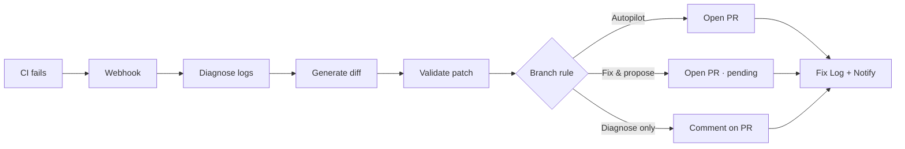

# Stitch

### OpenAI Build Week 2026 · Developer Tools · MIT License

> **CI fails while you sleep — Stitch diagnoses the logs, writes the fix, and opens the PR before you wake up.**

| | |
|---|---|
| **Event** | [OpenAI Build Week 2026](https://openai.devpost.com) |
| **Category** | Developer Tools |
| **License** | [MIT](LICENSE) |
| **Codex Session ID** | `PASTE_YOUR_/feedback_SESSION_ID_HERE` |
| **Repository** | `https://github.com/YOUR_USERNAME/YOUR_REPO` |
| **Demo video** | `https://youtube.com/watch?v=YOUR_VIDEO_ID` |

---

## Table of contents

1. [The problem](#the-problem)
2. [What Stitch does](#what-stitch-does)
3. [How it works](#how-it-works)
4. [Key features](#key-features)
5. [Branch-aware behavior](#branch-aware-behavior)
6. [What's built today](#whats-built-today)
7. [Try it yourself](#try-it-yourself)
8. [How we built it (Codex + OpenAI)](#how-we-built-it-codex--openai)
9. [Demo video](#demo-video)
10. [Installation & requirements](#installation--requirements)
11. [Story (Inspiration · Challenges · What's next)](#story)
12. [Built with](#built-with)
13. [Documentation](#documentation)
14. [Devpost copy-paste fields](#devpost-copy-paste-fields)
15. [Pre-submit checklist](#pre-submit-checklist)

---

## The problem

Broken CI at 2am usually means: someone notices the red badge, opens a chat, pastes logs, guesses at a fix, opens a PR, and hopes it passes. That loop is slow, manual, and easy to skip when nobody's watching.

**Stitch automates the loop.** A webhook fires on failure — no human opens a chat session to start it.

---

## What Stitch does

Stitch is a **webhook-triggered CI repair agent** with a full product dashboard.

When GitHub Actions fails, Stitch:

1. Pulls the failed job logs  
2. **Diagnoses** the root cause (OpenAI, Claude, Gemini, or Copilot — configurable per workspace)  
3. **Generates a fix** as a real unified diff against your repository (separate model call)  
4. Validates the patch, then opens a PR — or comments on an existing PR, depending on branch policy  
5. Notifies Slack/email and records everything in Fix Log, Issue Records, and Audit Trail  

The same JWT bug on `main` vs `feature/checkout-v2` gets **different behavior** — because production and experiments shouldn't share one trust level.

---

## How it works



**Two AI steps, on purpose:** diagnosis is read-only analysis; fix generation writes code. Splitting them makes the pipeline testable and easy to demo — you can show *what broke* before showing *what changed*.

---

## Key features

| Feature | Detail |
|---------|--------|
| **Autonomous pipeline** | Webhook → diagnose → patch → PR → notify → store |
| **Live GitHub integration** | Clone repo, `git apply`, push branch, open/merge/revert PR |
| **Branch router** | Per-pattern trust: Autopilot, Fix & propose, Diagnose & suggest |
| **Multi-model AI** | OpenAI, Anthropic, Gemini, Microsoft Copilot (Azure OpenAI) — mix providers per step |
| **Product dashboard** | Fix Log, Issues, Audit, Reports, SSE live feed |
| **RBAC** | Admin, Developer, Release Manager, Security roles on API routes |
| **Notifications** | Slack + email on fix events |
| **Jira** | Real REST API integration for ticket automation |
| **Revert flow** | Approve or revert fixes from dashboard; auto-revert on repeat failure |
| **Test repo** | 5 branches + 6 Dashboard simulate buttons — no improvisation during demo |
| **Demo fallback** | Works without API keys (deterministic JWT guard patch for judges) |

---

## Branch-aware behavior

| Branch pattern | Mode | What happens |
|----------------|------|--------------|
| `main` | Autopilot | Opens fix PR automatically |
| `release/*` | Fix & propose | Opens PR; human approves in Fix Log |
| `feature/*` | Diagnose & suggest | Posts suggested fix as PR comment |
| `dev` | Autopilot + auto-merge | Opens PR and merges when allowed |
| `hotfix/*` | Autopilot (urgent) | Opens fix PR on hotfix path |

Live test repo: **[Khushalsarode/stitch-test-flow-repo](https://github.com/Khushalsarode/stitch-test-flow-repo)** — deliberate CI failure (missing `JWT_SECRET` guard).

---

## What's built today

| ✅ Shipped in this submission | 🔜 Stretch / UI mockup only |
|------------------------------|----------------------------|
| GitHub Actions webhook → full pipeline | GitLab, CircleCI, Jenkins, Bitbucket (plugin interfaces stubbed) |
| Live PR: clone → patch → push → open PR | Hosted SaaS deploy (run locally for judges) |
| Branch rules for 5 branch types | Stripe billing page |
| PostgreSQL multi-tenant backend | Some Settings widgets use demo data |
| React dashboard + SSE | Linear / Asana ticketing |
| 25 automated tests (Vitest) | — |
| Multi-provider AI settings | — |

We'd rather show a **small, reliable end-to-end slice** than claim broad coverage that isn't wired.

---

## Try it yourself

### Fastest path (no GitHub — ~5 minutes)

```bash
git clone https://github.com/YOUR_USERNAME/YOUR_REPO
cd openai-build-week-hackathon

npm install && npm run frontend:install
cp .env.example .env
# Set DATABASE_URL — see setup.md

npm run db:migrate && npm run db:seed
npm run dev
```

| | |
|---|---|
| **UI** | http://localhost:5173 |
| **API** | http://localhost:3000 |
| **Login** | `demo@stitch.dev` / `demo1234` |
| **Quick test** | Dashboard → **Main · sandbox** |

Full pipeline runs with demo PR URL — no GitHub token required.

### Live PR path (~15 minutes)

1. Set `GITHUB_TOKEN` + `GITHUB_WEBHOOK_SECRET` in `.env`  
2. **Settings → Integrations → GitHub → Connect** (PAT + webhook secret)  
3. Dashboard → **Main · live PR**  

> **Note:** "Continue with GitHub" on the login page is for sign-in only. Live PRs require **Integrations → Connect**.

Step-by-step recording guide: **[STITCH-LIVE-SETUP.md](STITCH-LIVE-SETUP.md)**

```bash
npm test                  # 25 tests
npm run stitch:live-check # pre-flight before recording
```

---

## How we built it (Codex + OpenAI)

*Required by OpenAI Build Week judges.*

### Codex (`/feedback`)

Codex built the majority of the codebase:

- Express webhook receiver + org-scoped REST API  
- GitHub plugin: log fetch, file read, `git apply`, push, open PR, merge, revert  
- Pipeline: `diagnose → generateFix → validate → PR → notify → store`  
- Branch router + Settings-driven behavior  
- React dashboard, Fix Log, SSE live feed  
- Multi-provider AI layer (`src/ai/`)  
- Vitest suite + live test repo scaffolding  

**Session ID:** `PASTE_YOUR_/feedback_SESSION_ID_HERE`

### OpenAI (and other models) at runtime

| Step | Input | Output |
|------|-------|--------|
| **Diagnosis** | CI logs + repo context | Structured JSON: root cause, files, explanation, confidence |
| **Fix generation** | Diagnosis + file contents | Unified diff only — minimal patch |
| **Demo fallback** | Same pipeline, no API key | Deterministic JWT guard fix |

Also supported at runtime: **Anthropic Claude**, **Google Gemini**, **Azure OpenAI** (Copilot stack) — configured per workspace in Settings.

### Decisions we made (not the model)

- Split diagnosis and fix into two calls — testable, narratable, safer  
- Branch-aware autonomy instead of one global "auto-fix everything" toggle  
- PostgreSQL per-org isolation with seeded demo org for judges  
- Real failing CI in a dedicated test repo — not fake webhook payloads alone  
- Login OAuth vs Integrations PAT kept separate — login for humans, PAT for automation  

---

## Demo video

**Requirements:** Public YouTube · under **3 minutes** · audio must explain **Codex** and **OpenAI** usage.

| Time | Scene |
|------|-------|
| **0:00–0:15** | Problem — red CI, team offline |
| **0:15–0:35** | Trigger — webhook or Dashboard **Main · live PR** |
| **0:35–1:00** | Diagnosis — Fix Log card, root cause, confidence |
| **1:00–1:30** | Fix + PR — diff, real GitHub PR opened |
| **1:30–1:55** | Branch behavior — feature branch → comment, not new PR |
| **1:55–2:15** | Control — approve, revert, Settings branch rules |
| **2:15–2:40** | Codex vs runtime — what was built vs what runs at inference |
| **2:40–3:00** | Close — *"Stitch — the CI failure that fixes itself"* |

---

## Installation & requirements

| Requirement | Version |
|-------------|---------|
| Node.js | 20+ |
| PostgreSQL | 14+ |
| OS | Windows, macOS, Linux |

| Platform | Status |
|----------|--------|
| **GitHub Actions** | ✅ Fully wired — primary demo path |
| GitLab CI | Plugin interface, API stubbed |
| CircleCI | Plugin interface, API stubbed |
| Jenkins | Plugin interface, API stubbed |
| Bitbucket Pipelines | Plugin interface, API stubbed |

Detailed install: **[setup.md](setup.md)**

---

## Story

### Inspiration

We've all woken up to a red CI badge that could've been a five-line fix — if someone had read the logs overnight. Stitch removes the step where a human has to notice, open a chat, and paste a stack trace.

### Challenges we hit

- Making branch-aware behavior feel like **policy**, not magic  
- Real GitHub PR path (clone, apply, push) vs sandbox simulate — two code paths that had to both work  
- Keeping diagnosis and fix as separate, testable units without collapsing them for convenience  
- Multi-tenant Postgres at hackathon speed without over-engineering  

### Accomplishments we're proud of

- End-to-end GitHub pipeline with **live PR**  
- Full React product UI with SSE dashboard  
- **25** automated tests passing  
- Live test repo with intentional CI failure and **5 branch demos**  
- Multi-provider AI in Settings with working test buttons  

### What's next

Job queue for webhook bursts, persisted webhook idempotency, GitLab live plugin, hosted demo instance, encrypted secrets at rest.

---

## Built with

**Runtime:** Node.js · TypeScript · Express · React · Vite · Tailwind CSS · PostgreSQL · Prisma · Octokit · OpenAI SDK · Server-Sent Events  

**Build & test:** Vitest · Codex  

**Integrations:** GitHub Actions · Slack · Email · Jira Cloud  

---

## Documentation

| Document | Purpose |
|----------|---------|
| [README.md](README.md) | Project overview + quick start |
| [setup.md](setup.md) | Install, env vars, demo accounts |
| [STITCH-LIVE-SETUP.md](STITCH-LIVE-SETUP.md) | Record live GitHub demo |
| [testrepo/DEMO-FLOWS.md](testrepo/DEMO-FLOWS.md) | Every branch flow, step by step |
| [openai_project.md](openai_project.md) | Hackathon rules digest |

---

## Devpost copy-paste fields

Use the blocks below when filling out [openai.devpost.com](https://openai.devpost.com).

### Project name

```
Stitch
```

### Tagline

```
CI fails while you sleep — Stitch diagnoses the logs, writes the fix, and opens the PR before you wake up.
```

### About the project (description)

```
Stitch is a webhook-triggered agent for broken CI. When GitHub Actions fails, Stitch pulls the job logs, runs a diagnosis pass (OpenAI, Claude, Gemini, or Copilot — configurable per workspace), then a separate fix-generation pass that writes a real unified diff against your repository. It validates the patch, opens a pull request (or comments on an existing PR on feature branches), notifies Slack/email, and records everything in a Fix Log, Issue Record, and Audit Trail.

The same failure on main vs release/* vs feature/* gets different behavior — Autopilot, Fix & propose, or Diagnose & suggest — because production and experiments shouldn't be treated the same.

We built it as a real SaaS app: React dashboard, PostgreSQL multi-tenant backend, role-based permissions, and a seeded demo plus a live test repo with intentional CI failures for judges to trigger end-to-end.

Codex built the pipeline, GitHub plugin, branch router, dashboard, and multi-model AI layer. OpenAI (and other providers) power diagnosis and fix generation at runtime as two separate steps.
```

### Built with (tags)

```
Node.js, TypeScript, Express, React, PostgreSQL, Prisma, OpenAI, Codex, GitHub Actions, Octokit, Vitest
```

### Try it out / Installation notes

```
git clone https://github.com/YOUR_USERNAME/YOUR_REPO
cd openai-build-week-hackathon
npm install && npm run frontend:install
cp .env.example .env
# Set DATABASE_URL (PostgreSQL) — see setup.md
npm run db:migrate && npm run db:seed
npm run dev

Open http://localhost:5173
Login: demo@stitch.dev / demo1234
Dashboard → Main · sandbox (no GitHub required)

Live PR demo: STITCH-LIVE-SETUP.md in repo root.
Codex Session ID: PASTE_YOUR_/feedback_SESSION_ID_HERE
```

---

## Pre-submit checklist

Internal use — verify before clicking **Submit** on Devpost.

- [ ] Category: **Developer Tools**
- [ ] Public repo (or private + shared with `testing@devpost.com`, `build-week-event@openai.com`)
- [ ] [MIT LICENSE](LICENSE) in repo root
- [ ] Codex Session ID filled in README + this file
- [ ] Demo video on YouTube — public, under 3 min, audio covers Codex + OpenAI
- [ ] Video only shows flows that work in your branch
- [ ] Repository URL + video URL updated in the table at the top of this file
- [ ] Judges can run with `demo@stitch.dev` / `demo1234` (or credentials documented)
- [ ] Devpost draft saved before **July 21, 2026, 5:00 PM Pacific**

---

<p align="center">
  <strong>Stitch</strong> — built for OpenAI Build Week 2026<br/>
  <em>The CI failure that fixes itself.</em>
</p>
