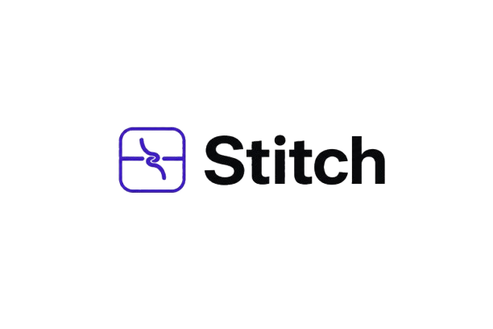
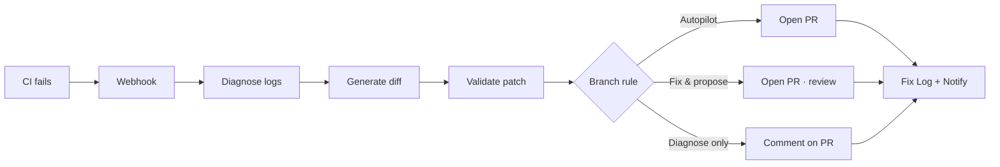
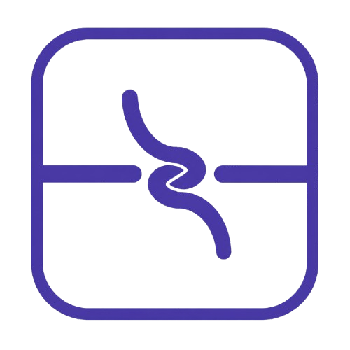
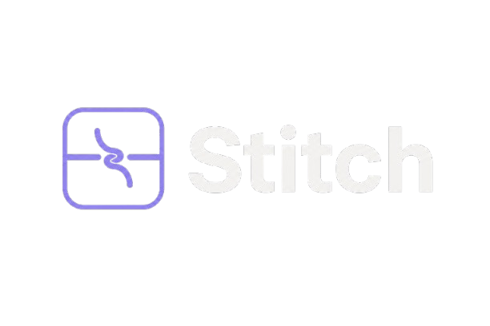

<p align="center">
  
</p>

<p align="center">
  <strong>The CI failure that fixes itself while you sleep.</strong><br/>
  Webhook in → diagnosis → validated patch → pull request out. No chat session required.
</p>

<p align="center">
  <a href="https://openai.devpost.com"></a>
  <a href="https://openai.devpost.com"></a>
  <a href="LICENSE"></a>
</p>

<p align="center">
  
  
  
  
  
  
</p>

<p align="center">
  <a href="#quick-start">Quick Start</a> ·
  <a href="#demo">Demo</a> ·
  <a href="#architecture">Architecture</a> ·
  <a href="setup.md">Setup Guide</a> ·  
  <a href="DEVPOST-SUBMISSION.md">Devpost</a>
</p>    

---  

## Overview

**Stitch** is a webhook-triggered CI repair agent with a full product dashboard. When GitHub Actions fails, Stitch pulls job logs, **diagnoses** the root cause, **generates a fix** as a real unified diff, validates the patch, and opens a pull request — or comments on an existing PR, depending on branch policy.

Built for **[OpenAI Build Week 2026](https://openai.devpost.com)** · **Developer Tools** track.

| | |
|---|---|
| **Repository** | [github.com/Khushalsarode/openai-build-week-hackathon](https://github.com/Khushalsarode/openai-build-week-hackathon) |
| **Demo login** | `demo@stitch.dev` / `demo1234` |
| **Local UI** | http://localhost:5173 |
| **Local API** | http://localhost:3000 |
| **Test repo** | [Khushalsarode/stitch-test-flow-repo](https://github.com/Khushalsarode/stitch-test-flow-repo) |

---

## How it works



**Two AI steps, on purpose:** diagnosis is read-only analysis; fix generation writes code. Splitting them makes the pipeline testable, demo-friendly, and safer.

---

## Features

| Feature | Description |
|---------|-------------|
| **Autonomous pipeline** | Webhook → diagnose → patch → PR → notify → store |
| **Live GitHub integration** | Clone, `git apply`, push branch, open / merge / revert PR |
| **Branch router** | Per-pattern trust: Autopilot, Fix & propose, Diagnose & suggest |
| **Multi-model AI** | OpenAI, Anthropic, Gemini, Microsoft Copilot — mix providers per step |
| **Product dashboard** | Fix Log, Issues, Audit Trail, Reports, SSE live feed |
| **RBAC** | Admin, Developer, Release Manager, Security roles |
| **Notifications** | Slack + email on fix events |
| **Jira** | Real REST API ticket automation |
| **Revert flow** | Approve or revert fixes; auto-revert on repeat failure |
| **Demo sandbox** | 6 Dashboard simulate buttons + seeded test repo |

---

## Branch-aware behavior

| Branch | Mode | Result |
|--------|------|--------|
| `main` | Autopilot | Opens fix PR |
| `release/*` | Fix & propose | Opens PR · pending review |
| `feature/*` | Diagnose & suggest | Comments on existing PR |
| `dev` | Autopilot + auto-merge | Opens PR and merges when allowed |
| `hotfix/*` | Autopilot (urgent) | Opens fix PR |

---

## What's built vs stretch

| Shipped in this submission | Stretch / UI mockup only |
|----------------------------|--------------------------|
| GitHub Actions webhook → full pipeline | GitLab, CircleCI, Jenkins, Bitbucket (plugins stubbed) |
| Live PR: clone → patch → push → open PR | Hosted SaaS deploy (run locally for judges) |
| Branch rules for 5 branch types | Stripe billing page |
| PostgreSQL multi-tenant backend | Some Settings widgets use demo data |
| React dashboard + SSE | Linear / Asana ticketing |
| 25 automated tests (Vitest) | — |
| Multi-provider AI settings | — |

---

## Quick start

### Prerequisites

- **Node.js 20+**
- **PostgreSQL 14+**

### Install & run

```bash
git clone https://github.com/Khushalsarode/openai-build-week-hackathon.git
cd openai-build-week-hackathon

npm install && npm run frontend:install
cp .env.example .env
# Set DATABASE_URL in .env

createdb stitch   # or your Postgres equivalent
npm run db:migrate && npm run db:seed
npm run dev
```

| Service | URL |
|---------|-----|
| **Frontend** (open this) | http://localhost:5173 |
| **API + webhooks** | http://localhost:3000 |

**Demo account:** `demo@stitch.dev` / `demo1234`

**Fastest test (no GitHub):** Dashboard → **Main · sandbox**

Full install details: **[setup.md](setup.md)**

---

## Demo

### Sandbox (no GitHub token)

1. Login as `demo@stitch.dev`
2. **Dashboard** → **Main · sandbox**
3. Watch Fix Log + live SSE feed

### Live PR (~15 min)

1. Set `GITHUB_TOKEN` + `GITHUB_WEBHOOK_SECRET` in `.env`
2. **Settings → Integrations → GitHub → Connect**
3. Dashboard → **Main · live PR**

Step-by-step recording guide: **[STITCH-LIVE-SETUP.md](STITCH-LIVE-SETUP.md)**

### Two GitHub connections

| | **Continue with GitHub** (login) | **Integrations → GitHub** (Connect) |
|---|---|---|
| Purpose | Sign in, sync repo list | CI automation: PRs, webhooks, merge |
| Required for live PR? | No | **Yes** (PAT + webhook secret) |

OAuth login alone does **not** enable live fixes. See [setup.md — GitHub](setup.md#github-two-different-connections).

---

## Architecture

```
openai-build-week-hackathon/
├── src/                  # Express API, pipeline, GitHub plugin, AI layer
├── frontend/             # React + Vite dashboard
├── prisma/               # PostgreSQL schema + seed (Acme Corp demo)
├── media/exports/png/    # Brand assets (logos, favicons, OG)
├── testrepo/             # Live demo repo (intentional CI failure)
├── tests/                # Vitest (25 cases)
└── scripts/              # Test repo setup, live demo checks
```

**Stack:** Node.js · TypeScript · Express · React · Vite · Tailwind CSS · PostgreSQL · Prisma · Octokit · OpenAI SDK · Server-Sent Events

---

## Scripts

| Command | Description |
|---------|-------------|
| `npm run dev` | API `:3000` + UI `:5173` |
| `npm run build` | Compile API + production frontend |
| `npm start` | Production server (single port) |
| `npm test` | Run 25 Vitest tests |
| `npm run db:seed` | Seed Acme Corp demo workspace |
| `npm run testrepo:setup` | Push test repo branches to GitHub |
| `npm run stitch:live-check` | Pre-flight check before live demo |

---

## How Codex & OpenAI were used

> Required for OpenAI Build Week judges.

| | |
|---|---|
| **Codex Session ID (`/feedback`)** | `PASTE_YOUR_SESSION_ID_HERE` |
| **Codex built** | Pipeline, GitHub plugin, branch router, dashboard, multi-model AI layer, test repo flows |
| **OpenAI at runtime** | Diagnosis JSON from CI logs; separate call generates unified diff |
| **Demo fallback** | Deterministic JWT guard patch when no API key is set |
| **Our decisions** | Split diagnosis/fix steps, branch-aware trust, Postgres multi-tenant, real failing CI test repo |

Full Devpost copy: **[DEVPOST-SUBMISSION.md](DEVPOST-SUBMISSION.md)**

---

## Documentation

| Document | Description |
|----------|-------------|
| [setup.md](setup.md) | Install, env vars, demo accounts, troubleshooting |
| [STITCH-LIVE-SETUP.md](STITCH-LIVE-SETUP.md) | Record live GitHub demo |
| [DEVPOST-SUBMISSION.md](DEVPOST-SUBMISSION.md) | Public submission page + Devpost fields |
| [testrepo/DEMO-FLOWS.md](testrepo/DEMO-FLOWS.md) | Every branch demo flow |
| [openai_project.md](openai_project.md) | Hackathon rules digest |
| [plan/stitch-implementation-plan.md](plan/stitch-implementation-plan.md) | Full build plan & data contracts |

---

## Brand assets

Logos and icons live in [`media/exports/png/`](media/exports/png/). Rebuild from SVG masters:

```bash
npm run media:build
```

<p align="center">
  
  &nbsp;&nbsp;
  
</p>

---

## License

[MIT](LICENSE) © 2026 Stitch contributors

---

<p align="center">
  <sub>Built with Codex + OpenAI for OpenAI Build Week 2026</sub>
</p>
