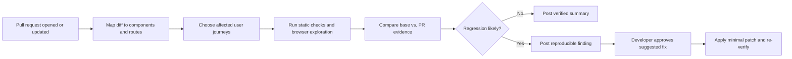

# Accessibility Regression Agent — product plan

## 1. Working concept

**Working name:** A11y Sentinel

A11y Sentinel is a PR-aware development tool that discovers accessibility regressions before merge. It reads a pull request's code diff and changed user journeys, executes targeted browser checks, turns failures into reproducible evidence, and proposes the smallest safe repair. It is designed as a teammate for AI-assisted development: it makes fast agent-authored changes trustworthy rather than simply generating more code.

The product should never claim that an automated scan makes an application fully accessible. Its promise is narrower and credible: **identify likely regressions introduced by this change, prove them with repeatable evidence, and help developers resolve them safely.**

## 2. Problem and target user

AI coding tools increase the rate at which UI code changes. Those changes frequently introduce subtle accessibility regressions: an icon loses its accessible name, a modal no longer traps focus, a form error is invisible to screen readers, or a keyboard path becomes unreachable. Typical linting and static scans catch only a subset; manual testing is slow and commonly deferred until late in the release cycle.

Primary user: a product engineer shipping a web-app pull request.

Secondary users:

- Reviewers who need clear, verified risk signals instead of a generic accessibility score.
- Accessibility specialists who want high-quality, reproducible reports rather than broad scanner output.
- Engineering leaders who want quality controls that keep pace with AI-assisted delivery.

## 3. Product thesis and differentiation

Most accessibility tools scan a deployed page and return a list of rule violations. A11y Sentinel is different in four ways:

1. **Diff-aware:** it prioritizes pages, components, and interactions affected by the PR.
2. **Journey-aware:** it uses browser automation to test keyboard and focus behavior, not just DOM rules.
3. **Evidence-first:** every finding includes the relevant PR change, a concrete reproduction script, screenshots/DOM snapshots where helpful, and the exact rule or heuristic used.
4. **Fix-safe:** it proposes a minimal patch, explains trade-offs, and requires developer approval before any edit or PR update.

## 4. The end-to-end experience



Example: a PR replaces a labelled `button` with an icon-only control. Sentinel maps the changed component to the account settings route, finds it in a running preview, sees an unnamed interactive control, tests keyboard focus, and posts a PR comment with the selector, affected route, keyboard steps, screenshot/DOM excerpt, WCAG reference, and an optional `aria-label` patch. After approval, it applies the patch and reruns the same check.

## 5. Scope: a strong MVP plus an intentional expansion path

### Release 1 — hackathon MVP

The MVP should support one modern web-stack sample application and one narrow but persuasive flow.

| Capability | MVP behavior |
| --- | --- |
| PR input | Local git branch/diff, with a GitHub PR adapter as an optional demo integration. |
| Change understanding | Identify changed UI files and map them to a small route/component manifest. |
| Browser run | Start the app locally, open selected routes, and run a deterministic Playwright journey. |
| Checks | axe-core rule scan plus keyboard navigation, focus visibility/order, accessible names, form labels, and modal focus return. |
| Regression logic | Compare base branch with PR branch; report newly introduced or worsened findings only. |
| Evidence | Route, selector, severity/confidence, keyboard reproduction steps, affected diff context, and an artifact link/screenshot. |
| Fix assistance | Generate a suggested minimal diff but do not write it until a human approves. |
| Output | PR-style report in the product UI; optionally publish a GitHub review comment. |

### Release 2 — broader developer-tool vision

After the demo, evolve from a focused PR checker into an accessibility quality agent for AI-assisted teams:

- Learn component ownership, design-system patterns, routes, and test conventions from the repository.
- Derive and prioritize journeys from changed code, existing E2E tests, issue text, and product analytics supplied by the team.
- Test responsive layouts, dark mode, localization, and authenticated states using safe seeded accounts.
- Add screen-reader-oriented semantic checks and optional human-review queues for ambiguous results.
- Generate regression tests alongside approved fixes, so the failure cannot silently return.
- Maintain an accessibility change ledger: recurring regressions, resolved findings, accepted risks, and policy exceptions.
- Run as a GitHub App, CLI, and CI action; use the same evidence model across all surfaces.

### Explicit non-goals for the first build

- Certifying WCAG conformance or replacing accessibility experts.
- Autonomous commits, merges, or production changes.
- Broad crawling of arbitrary production sites.
- Solving every disability/accessibility need in one release.
- Supporting every framework before the core loop is reliable.

## 6. Product workflow and human gates

The agent has four bounded phases. Each phase records inputs, tool calls, and outputs in an audit trail.

1. **Understand:** inspect the diff and route manifest; state which journeys it will test and why.
2. **Verify:** run static and browser checks against base and PR versions; preserve reproducible artifacts.
3. **Explain:** cluster duplicates, distinguish confirmed regressions from lower-confidence suspicions, and show the evidence.
4. **Repair (optional):** draft the smallest compatible fix and a regression test. The developer must approve the exact patch before it changes code.

Human approval is required for changing source code, creating a commit, posting an external PR comment, or treating a low-confidence heuristic as a blocking issue.

## 7. Technical plan

### Suggested stack

| Layer | Recommendation | Reason |
| --- | --- | --- |
| Demo app | Next.js + TypeScript | Fast UI iteration and easy component/route examples. |
| Agent service | Node.js + TypeScript | Shares types and tooling with the demo app. |
| Browser execution | Playwright | Deterministic navigation, keyboard input, screenshots, traces. |
| Rule engine | axe-core | Mature baseline checks with recognizable results. |
| Diff analysis | Git CLI + TypeScript parser | Reliable base/PR comparison and component discovery. |
| AI reasoning | OpenAI Responses API with structured outputs/tools | Route selection, finding explanation, and constrained patch drafts. |
| Persistence | SQLite for demo; Postgres later | Stores runs, findings, approvals, and artifact metadata. |
| Integration | GitHub App/webhook later; local CLI first | Keeps the live demo reliable while preserving the product direction. |

### Core internal modules

- **Repository mapper:** builds a component-to-route manifest from a small configuration file, then later learns it from project conventions.
- **Change analyzer:** extracts changed UI files, exports, strings, and relevant tests from the git diff.
- **Journey planner:** selects a capped set of impacted routes/interactions and explains each selection.
- **Browser verifier:** runs deterministic Playwright checks plus axe-core; stores trace, screenshot, DOM summary, and command output.
- **Regression comparator:** normalizes base and PR findings, suppresses known baseline debt, and identifies net-new evidence.
- **Finding author:** creates structured reports with confidence, severity, reproduction, and source links.
- **Patch proposer:** generates a constrained edit and matching test only after a confirmed finding; it never applies changes automatically.
- **Approval/audit service:** records the plan, evidence, approval decision, patch, and verification result.

### Data model (first pass)

```text
AnalysisRun
  id, repository, baseRef, headRef, status, startedAt, finishedAt

Journey
  id, runId, route, trigger, reasonSelected, priority

Finding
  id, runId, journeyId, ruleId, category, severity, confidence,
  regressionStatus, selector, summary, reproduction, diffContext

Artifact
  id, findingId, type, pathOrUrl, checksum

ProposedFix
  id, findingId, patch, explanation, testPatch, approvalStatus, verificationStatus
```

## 8. Detection strategy

Use a layered model rather than trusting any single checker:

| Signal | What it catches | Confidence |
| --- | --- | --- |
| Static axe rules | Missing labels, invalid ARIA, contrast, landmark problems | High when deterministic |
| DOM/semantic comparison | Changed roles, names, labels, heading and form structure | Medium–high |
| Keyboard journey | Focus traps, focus loss, unreachable controls, illogical order | Medium–high with reproducible steps |
| Visual focus capture | Invisible or obscured focus indicators | Medium; show screenshot evidence |
| AI-guided review | Suspicious changes or untested states inferred from the diff | Lower until browser-verified |

Findings must be labelled **confirmed regression**, **likely regression**, or **needs human review**. Only confirmed regressions should block a demo PR by default.

## 9. Demo scenario

Seed a realistic but deliberately broken pull request in a small project-management or shopping application.

1. Open a PR that introduces an icon-only “Delete project” button and a modal with broken focus return.
2. Sentinel shows its plan: changed `ProjectActions` affects `/projects/:id`; it will exercise delete and cancel flows.
3. Run base and PR checks side-by-side. The base passes; the PR fails for the unnamed button and keyboard/focus behavior.
4. Open a finding to see the changed code, route, selector, exact keyboard steps, screenshot/trace, and rule explanation.
5. Review the suggested two-file fix and test. Approve it.
6. Sentinel applies the patch, reruns the journey, and posts a compact “verified fixed” report.

This creates a clean story: AI helped create a UI change; the accessibility agent caught a real regression, provided proof, and repaired it with explicit human control.

## 10. Milestones

### Milestone A — foundation (day 1)

- Create the demo web app with two routes and seeded accessible components.
- Add a route/component manifest and base/PR git fixtures.
- Establish one deterministic Playwright journey and capture its artifacts.

### Milestone B — regression engine (day 2)

- Add axe-core scans and normalized finding format.
- Run the same journey against base and changed branches.
- Identify only net-new failures and render an evidence report.

### Milestone C — agent and approval experience (day 3)

- Add the agent-generated journey plan and constrained finding explanation.
- Build the review UI: plan, evidence, confidence, and approval gate.
- Draft but do not automatically apply a minimal repair.

### Milestone D — polished end-to-end demo (day 4)

- Apply approved patch in an isolated workspace and re-verify.
- Add audit timeline, loading/error states, and a short README.
- Record the three-minute demo and prepare seeded fallback data in case an external integration fails.

## 11. Success measures

For the hackathon demo, success means:

- Detect at least two intentional regressions on the PR branch and none on the base branch.
- Produce a repeatable reproduction path and artifact for each finding.
- Demonstrate one approved, minimal repair that passes its original check after re-run.
- Keep a full analysis run under roughly three minutes on the sample repo.
- Make it immediately clear why the tool is safer and more useful than a generic lint report.

For a real beta, measure precision of reported regressions, developer acceptance rate of proposed fixes, time-to-resolution, false-positive rate, and repeat-regression rate after generated tests land.

## 12. Risks and mitigations

| Risk | Mitigation |
| --- | --- |
| Noisy findings reduce trust | Compare to the base branch, require concrete evidence, and label confidence clearly. |
| Browser automation is flaky | Use a small deterministic demo app, stable selectors, seeded data, retries only where evidence justifies them. |
| AI proposes unsafe/broad edits | Constrain edits to files linked to the finding; require patch approval and re-verification. |
| Overclaiming accessibility coverage | Use explicit non-certification language and show the limits of each check. |
| GitHub integration consumes too much time | Make local CLI/demo mode the core path; treat GitHub PR comments as a thin optional layer. |
| Scope grows beyond the deadline | Preserve the single excellent loop: diff → evidence → approved fix → verified re-run. |

## 13. Decisions for review

Please comment on these before implementation:

1. **Product name:** Keep *A11y Sentinel*, choose another working name, or remain unnamed for now?
2. **First integration:** Should the first demo be local-first (more reliable) or GitHub PR-first (more immediately legible)?
3. **Demo app:** Prefer a project-management app, e-commerce checkout, or an existing application you want this tool to analyze?
4. **Agent boundary:** Is “suggest + approve before applying” the right initial trust model, or should the demo stop at proposed patches?
5. **Ambition:** Which Release 2 direction matters most: AI-generated regression tests, broader journey discovery, or an organization-wide accessibility ledger?

## 14. Proposed first implementation slice after approval

Build a local TypeScript web demo that analyzes a seeded PR containing two accessibility regressions. It will generate a journey plan, run Playwright + axe checks against base and PR, show evidence-backed net-new findings, suggest a small fix, and re-run verification only after approval. GitHub review comments, generalized repository learning, and automated source edits remain post-MVP.
