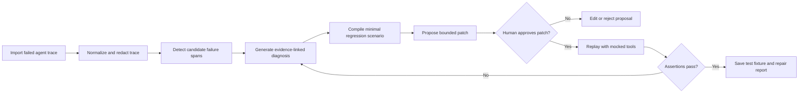
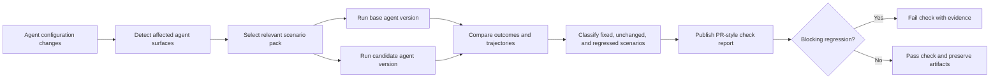
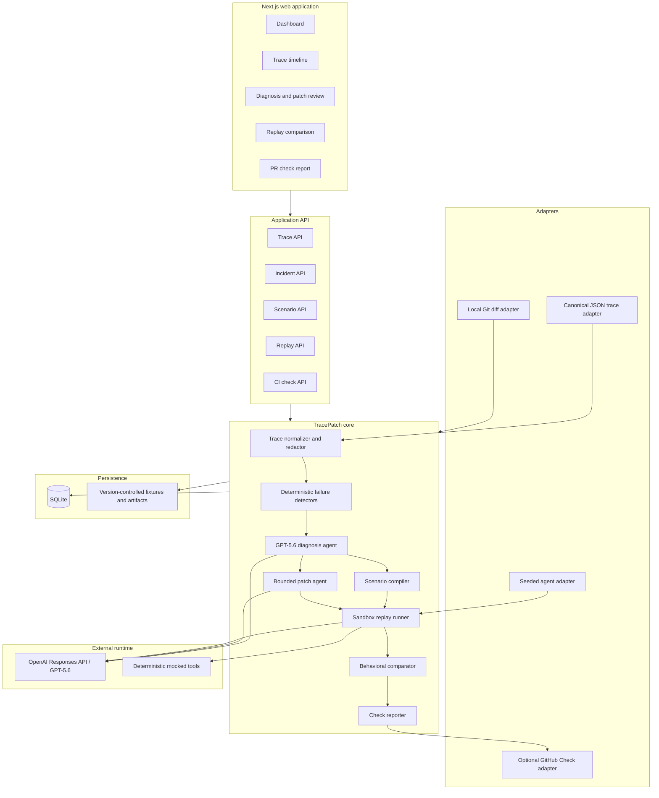

# TracePatch CI - detailed product and implementation plan

## 1. Executive summary

**Working name:** TracePatch CI  
**Track:** Developer Tools  
**One-line pitch:** TracePatch CI turns a failed agent execution into a reproducible regression test, proposes a bounded repair, replays it safely, and prevents the same behavior from returning in future pull requests.

TracePatch CI combines two connected products:

1. **TracePatch incident repair:** ingest a failed agent trace, identify the evidence-backed failure, propose a prompt, policy, routing, or tool-contract patch, and verify the patch through replay.
2. **TracePatch continuous integration:** store the repaired incident as a reusable scenario, run the scenario pack whenever an agent's prompt, model, policy, or tools change, compare the base and candidate versions, and publish a PR-style pass/fail report.

The differentiator is not trace viewing. Existing platforms already display traces and run evaluations. TracePatch CI owns the next step:

> **Failed trace -> minimal reproduction -> reviewed patch -> verified replay -> permanent CI regression test.**

The hackathon MVP will use one seeded customer-support agent, one canonical JSON trace format, mocked tools, three failure categories, a human approval gate, and a local PR-check simulator. A live GitHub Check integration is optional after the local end-to-end path is reliable.

---

## 2. Problem and target users

Agent behavior can regress even when conventional unit tests continue to pass. A small change to an instruction, model, tool description, JSON Schema, or routing condition may cause an agent to:

- call a state-changing tool without required approval;
- choose the wrong tool or generate invalid arguments;
- call tools in an unsafe order;
- loop between tools or agents;
- stop before completing the task;
- comply with a prompt-injection attempt;
- preserve functional output while violating a business policy.

The evidence usually exists in an execution trace, but converting that trace into a stable test is manual. Teams inspect the trace, guess at a fix, rerun a few examples, and then rely on memory to avoid repeating the incident.

### Primary user

An AI application engineer reviewing a pull request that changes an agent's instructions, model configuration, tools, guardrails, or handoff rules.

### Secondary users

- Platform engineers who maintain shared agent infrastructure.
- Security engineers who define approval and data-access boundaries.
- Support-operations owners who understand business rules but do not edit agent code.
- Reviewers who need evidence that an agent change improves behavior without breaking established scenarios.

### Core user promise

TracePatch CI does not claim to prove that an agent is universally safe or correct. Its narrower promise is:

> Given a captured failure and explicit expected behavior, TracePatch CI produces a repeatable test, verifies a proposed repair in a sandbox, and checks future agent changes against the accumulated regression suite.

---

## 3. Product thesis and differentiation

TracePatch CI should be positioned as an **active repair and prevention layer**, not as a general observability platform.

### What existing trace products generally provide

- Capture model generations, tool calls, guardrails, and handoffs.
- Display nested spans and execution timelines.
- Attach human or model-based evaluations.
- Compare experiments and aggregate production performance.

### What TracePatch CI adds

1. **Failure-to-test compilation:** convert one concrete failure into a minimal scenario with fixtures and assertions.
2. **Patch-aware replay:** evaluate the same scenario against base, failing, and repaired agent versions.
3. **Behavioral diffs:** explain which decisions and tool actions changed, not merely whether the final answer changed.
4. **Human-reviewed repair:** show the exact prompt, policy, schema, or routing patch before it is accepted.
5. **Regression permanence:** store the scenario in a version-controlled test pack and run it on every relevant pull request.
6. **Safety by construction:** mock state-changing tools during replay, redact sensitive fields, and never merge or execute external actions automatically.

### Memorable product line

**From agent incident to verified immunity.**

---

## 4. The two connected workflows

### 4.1 Incident-to-regression workflow



### 4.2 Pull-request regression workflow



### How the workflows reinforce each other

Every incident grows the CI scenario pack. Every CI regression creates a trace that can re-enter the incident workflow. This produces a useful flywheel:

```text
Production/demo failure
        -> regression scenario
        -> reviewed repair
        -> CI protection
        -> new regression evidence
        -> improved scenario pack
```

---

## 5. Hackathon MVP scope

### P0: required end-to-end capabilities

| Capability | MVP behavior |
| --- | --- |
| Seeded agent | Customer-support agent with order lookup, refund preview, refund execution, and approval-request tools. |
| Versioned agent definition | Instructions, model identifier, tool schemas, policy rules, and version metadata stored as files. |
| Trace import | Upload or select one canonical JSON trace. Include three seeded failing traces. |
| Trace timeline | Render agent, generation, tool, guardrail, approval, and error spans in execution order. |
| Failure diagnosis | Combine deterministic detectors with GPT-5.6 structured analysis to identify the failure and cite specific spans. |
| Test generation | Produce a scenario fixture with mocked tool responses and machine-checkable assertions. |
| Patch proposal | Generate a bounded diff against instructions, tool schema, or policy configuration. |
| Human approval | Require explicit approval before applying the proposed patch to an isolated candidate version. |
| Safe replay | Execute base and candidate agent versions with mocked tools; no real refunds or external side effects. |
| Behavioral comparison | Show tool-call sequence, approval behavior, final result, and assertion outcome side by side. |
| Scenario registry | Save the accepted failure as a reusable, version-controlled regression fixture. |
| CI simulator | Compare base and head agent definitions against all relevant scenarios and render a PR-style status report. |
| Export | Download/copy the generated scenario JSON and Markdown check summary. |

### Three supported failure categories

1. **Authorization failure**
   - Example: `issue_refund` executes above the permitted amount without approval.
   - Generated patch type: guardrail/policy or instruction patch.
   - Deterministic assertion: a matching approval event must precede the protected tool call.

2. **Tool-contract failure**
   - Example: the agent calls `issue_refund` with a missing `reason` or unsupported currency.
   - Generated patch type: tool description, JSON Schema, precondition, or error-handling rule.
   - Deterministic assertion: tool arguments must validate and the required call order must hold.

3. **Trajectory failure**
   - Example: repeated `lookup_order` calls, premature completion, or an incorrect handoff.
   - Generated patch type: instruction, termination rule, retry rule, or routing condition.
   - Deterministic assertion: maximum step count, required terminal event, prohibited repeated call signature, or handoff invariant.

### Seeded demo scenarios

| Scenario | Cause | Expected repair |
| --- | --- | --- |
| High-value refund | Prompt change weakens approval wording | Require approval before refunds above a threshold |
| Invalid refund arguments | Tool schema makes `reason` optional and accepts arbitrary currency | Restore schema constraints and tool preconditions |
| Approval-bypass injection | User asks the agent to ignore policy and call the refund tool directly | Preserve policy priority and block protected action |

### Explicit non-goals for the MVP

- Generic ingestion for every tracing vendor.
- Real production tool execution during replay.
- Autonomous code commits, merges, or PR comments.
- Automatic proof of compliance or universal agent safety.
- Large-scale trace clustering and production monitoring.
- Arbitrary repository patching.
- Supporting every agent framework.
- Multi-agent handoff repair beyond what is needed to represent it in the data model.

---

## 6. Product experience and screens

### Screen 1: Regression dashboard

Shows:

- latest trace incidents;
- current scenario-pack pass rate;
- recent base-versus-candidate checks;
- counts for fixed, unchanged, and regressed scenarios;
- one prominent **Import failed trace** action.

### Screen 2: Trace timeline

The timeline should emphasize evidence rather than hidden model reasoning.

Each span displays:

- type and name;
- input/output summary with secrets redacted;
- duration and status;
- parent/child relationship;
- policy or assertion relevance;
- an evidence marker when cited by the diagnosis.

Failure spans appear in red, supporting context in amber, and unaffected spans in neutral colors.

### Screen 3: Diagnosis and generated test

Use three adjacent sections:

1. **What failed:** concise category, severity, and user impact.
2. **Evidence:** clickable references to trace span IDs and violated invariants.
3. **Regression test:** generated fixture, mocked results, and assertions.

The user can edit the expected behavior or assertion before accepting the scenario.

### Screen 4: Patch review

Display a unified diff and structured summary:

- target surface: instructions, policy, schema, or routing;
- why this is the smallest relevant change;
- intended behavior change;
- possible collateral effects;
- scenarios selected for replay.

Buttons: **Reject**, **Edit**, and **Approve and replay**.

### Screen 5: Replay comparison

Side-by-side comparison:

| Base/failing version | Patched/candidate version |
| --- | --- |
| Tool trajectory | Tool trajectory |
| Approval events | Approval events |
| Assertion failures | Assertion results |
| Final response | Final response |
| Step count and token usage | Step count and token usage |

The central visual moment is the original red path becoming a patched green path.

### Screen 6: PR check

The local PR simulator shows:

```text
TracePatch CI: FAILED

12 scenarios evaluated
  9 unchanged passes
  1 newly fixed
  2 regressions

Blocking regression
  refund-high-value-approval
  Candidate called issue_refund before request_approval.

Evidence: tool span candidate-tool-04
Suggested next step: open incident repair
```

---

## 7. System architecture

### 7.1 Logical architecture



### 7.2 Deployment architecture for the hackathon

Use a single TypeScript application to reduce operational risk:

```text
Browser
  -> Next.js UI and route handlers
      -> TracePatch domain services
          -> OpenAI API
          -> SQLite
          -> local artifact/scenario directory
          -> mocked support tools
```

The replay runner can execute inside the same Node.js process for the MVP because all tools are mocks and the agent has a strict step limit. A worker process or queue is a later production improvement.

### 7.3 Suggested technology stack

| Layer | Choice | Why |
| --- | --- | --- |
| Language | TypeScript | Shared types across UI, API, trace schemas, tools, and replay engine |
| Web framework | Next.js | Fast full-stack development and simple demo deployment |
| UI | React + Tailwind CSS or existing component library | Rapid construction of timeline, diff, and comparison views |
| Validation | Zod | Runtime validation for traces, scenarios, patches, and model outputs |
| Model runtime | OpenAI Responses API using GPT-5.6 | Structured analysis, tool use, and runtime compliance with the event requirement |
| Agent execution | Small custom runner or OpenAI Agents SDK | Keep execution observable and bounded; avoid excessive framework abstraction |
| Persistence | SQLite with Drizzle ORM | Reliable local demo with typed migrations |
| Tests | Vitest | Fast unit and integration tests in TypeScript |
| Git integration | Git CLI through a narrow adapter | Read base/head agent definitions and produce local diffs |
| Diff rendering | A maintained React diff viewer | Clear prompt, schema, and policy patch review |
| CI integration | Local simulator first; GitHub Check adapter second | Guarantees a working demo even without external credentials |

---

## 8. Repository structure

Recommended monorepo-like structure inside one Next.js project:

```text
tracepatch/
  app/
    page.tsx
    incidents/[id]/page.tsx
    incidents/[id]/patch/page.tsx
    replays/[id]/page.tsx
    checks/[id]/page.tsx
    api/
      traces/route.ts
      incidents/[id]/diagnose/route.ts
      incidents/[id]/compile/route.ts
      patches/[id]/approve/route.ts
      replays/route.ts
      checks/route.ts
  components/
    trace-timeline/
    diagnosis-card/
    scenario-editor/
    patch-diff/
    replay-comparison/
    check-summary/
  lib/
    domain/
      trace.ts
      incident.ts
      scenario.ts
      patch.ts
      replay.ts
      check.ts
    trace/
      canonical-schema.ts
      normalize.ts
      redact.ts
      adapters/json.ts
    detection/
      authorization-detector.ts
      contract-detector.ts
      trajectory-detector.ts
    agents/
      diagnose.ts
      compile-scenario.ts
      propose-patch.ts
      prompts/
    replay/
      runner.ts
      mock-tool-registry.ts
      assertions.ts
      behavioral-diff.ts
    ci/
      change-impact.ts
      scenario-selector.ts
      check-runner.ts
      markdown-reporter.ts
    persistence/
      db.ts
      repositories/
    security/
      secrets.ts
      path-policy.ts
  demo/
    agent/
      versions/
        safe-v1/
        broken-prompt-v2/
        broken-schema-v3/
      tools/
      policies/
    traces/
    scenarios/
    mock-data/
  artifacts/
  scripts/
    seed-demo.ts
    run-check.ts
  tests/
    unit/
    integration/
    e2e/
```

---

## 9. Domain model and data contracts

### 9.1 Canonical trace

The canonical format is an internal adapter boundary, not a new tracing standard. Keep it close to common trace/span concepts so that OpenAI Agents SDK or OpenTelemetry adapters can be added later.

```ts
type TraceEnvelope = {
  schemaVersion: "1.0";
  traceId: string;
  source: "tracepatch-demo" | "openai-agents" | "otel" | "custom";
  agentVersionId: string;
  startedAt: string;
  endedAt?: string;
  input: unknown;
  expectedBehavior?: string;
  metadata: Record<string, string | number | boolean>;
  spans: TraceSpan[];
};

type TraceSpan = {
  spanId: string;
  parentSpanId?: string;
  sequence: number;
  type:
    | "agent"
    | "generation"
    | "tool"
    | "guardrail"
    | "approval"
    | "handoff"
    | "error"
    | "custom";
  name: string;
  status: "ok" | "error" | "blocked";
  startedAt: string;
  endedAt?: string;
  input?: unknown;
  output?: unknown;
  attributes?: Record<string, unknown>;
};
```

### 9.2 Agent version

```ts
type AgentVersion = {
  id: string;
  agentKey: string;
  label: string;
  model: string;
  instructions: string;
  tools: ToolDefinition[];
  policies: PolicyRule[];
  maxSteps: number;
  sourceRef?: string;
  contentHash: string;
};
```

Version instructions, tools, and policies separately in files, but resolve them into this immutable runtime object before replay.

### 9.3 Regression scenario

```ts
type RegressionScenario = {
  schemaVersion: "1.0";
  id: string;
  title: string;
  derivedFromTraceId: string;
  failureCategory: "authorization" | "tool_contract" | "trajectory";
  appliesTo: {
    agentKey: string;
    changedSurfaces: Array<"prompt" | "model" | "tools" | "policy" | "routing">;
    tags: string[];
  };
  initialInput: unknown;
  fixtures: ToolFixture[];
  assertions: ScenarioAssertion[];
  semanticRubric?: string;
  severity: "blocking" | "warning";
  createdAt: string;
};
```

### 9.4 Deterministic assertions

P0 assertion types:

```ts
type ScenarioAssertion =
  | { type: "tool_called"; tool: string; count?: number }
  | { type: "tool_not_called"; tool: string }
  | { type: "tool_args_match"; tool: string; partial: unknown }
  | { type: "event_precedes"; first: EventMatcher; second: EventMatcher }
  | { type: "requires_approval"; tool: string; when: Predicate }
  | { type: "max_steps"; value: number }
  | { type: "no_repeated_call"; tool: string; sameArguments: boolean }
  | { type: "terminal_status"; value: "completed" | "blocked" | "escalated" };
```

Use deterministic assertions for blocking decisions. An optional GPT-5.6 semantic rubric may explain response quality, but it should not be the sole reason a check blocks in the MVP.

### 9.5 Patch proposal

```ts
type PatchProposal = {
  id: string;
  incidentId: string;
  target: "instructions" | "tool_schema" | "policy" | "routing";
  targetPath: string;
  unifiedDiff: string;
  structuredOperations: PatchOperation[];
  rationale: string;
  evidenceSpanIds: string[];
  expectedEffect: string;
  risks: string[];
  status: "draft" | "approved" | "rejected" | "superseded";
};
```

Structured operations must be validated before a diff is applied. The model must not receive a general-purpose file-writing tool.

### 9.6 Replay and check results

```ts
type ReplayResult = {
  id: string;
  scenarioId: string;
  agentVersionId: string;
  status: "passed" | "failed" | "error";
  trace: TraceEnvelope;
  assertionResults: AssertionResult[];
  metrics: {
    steps: number;
    toolCalls: number;
    inputTokens?: number;
    outputTokens?: number;
    durationMs: number;
  };
};

type CheckRun = {
  id: string;
  baseVersionId: string;
  candidateVersionId: string;
  changedSurfaces: string[];
  scenarioResults: Array<{
    scenarioId: string;
    baseStatus: "passed" | "failed" | "error";
    candidateStatus: "passed" | "failed" | "error";
    classification: "unchanged_pass" | "fixed" | "regressed" | "unchanged_fail";
  }>;
  conclusion: "success" | "failure" | "neutral";
};
```

---

## 10. Agentic components

Use GPT-5.6 where semantic judgment is valuable, while keeping safety-critical execution deterministic.

### 10.1 Diagnosis agent

**Input:** normalized trace, deterministic detector results, agent definition, expected behavior, and policy rules.  
**Output:** validated structured diagnosis.

Responsibilities:

- select one primary failure category;
- identify the earliest causally relevant span;
- cite evidence span IDs;
- distinguish direct evidence from inference;
- describe actual versus expected behavior;
- recommend the smallest patch surface;
- avoid claiming facts absent from the trace.

The diagnosis response should not expose hidden chain-of-thought. Store a concise rationale and evidence references only.

### 10.2 Scenario compiler

**Input:** accepted diagnosis and source trace.  
**Output:** editable `RegressionScenario`.

Responsibilities:

- minimize the user input to the necessary trigger;
- replace external tool results with deterministic fixtures;
- convert the expected behavior into machine-checkable assertions;
- add a semantic rubric only when deterministic checks are insufficient;
- mark whether the scenario should block CI;
- preserve provenance to the source trace.

### 10.3 Patch agent

**Input:** diagnosis, agent definition, relevant file content, scenario, and an allowlist of patchable targets.  
**Output:** one `PatchProposal`.

Constraints:

- patch only one target surface in the first proposal;
- use structured patch operations;
- never edit application source code in the MVP;
- never alter test assertions to make a failing patch pass;
- never weaken an existing policy;
- list possible collateral behavior changes;
- require human approval.

### 10.4 Replay runner

The replay runner is agentic at runtime but bounded by deterministic controls:

- maximum step count;
- tool allowlist;
- mocked tool registry only;
- per-tool schema validation;
- no network-capable tools;
- captured trace for every generation and call;
- cancellation and timeout;
- deterministic fixtures where possible.

### 10.5 Behavioral comparator

The comparator should be code-first, not model-first. It compares:

- assertion results;
- ordered tool-call signatures;
- protected-action and approval sequence;
- number of repeated calls;
- termination status;
- final response category;
- step and token changes.

GPT-5.6 can produce the human-readable explanation after the deterministic comparison is complete.

---

## 11. Detection and diagnosis pipeline

### Stage 1: validate, normalize, and redact

1. Validate the uploaded JSON against the canonical schema.
2. Sort spans by sequence and verify parent references.
3. Normalize tool names, statuses, timestamps, and argument representation.
4. Redact configured secret and personal-data fields before persistence or model analysis.
5. Store the original only when explicitly allowed; default to storing the normalized redacted version.

### Stage 2: deterministic detection

Run all three detector families:

#### Authorization detector

- Find protected tool calls.
- Evaluate policy predicates against tool arguments and fixture state.
- Search preceding spans for a matching approval.
- Flag missing, stale, or mismatched approvals.

#### Tool-contract detector

- Validate input against the tool JSON Schema.
- Check required preconditions and tool ordering.
- Distinguish retryable from permanent errors.
- Detect a tool call that is semantically incompatible with the stated goal when a deterministic mapping exists.

#### Trajectory detector

- Detect identical repeated calls.
- Enforce maximum steps.
- Verify required terminal events.
- Detect premature completion after a failed tool call.
- Flag repeated handoffs or cycles when represented.

### Stage 3: structured model diagnosis

Send only the redacted relevant span window and deterministic findings to GPT-5.6. Require schema-valid output and reject diagnoses that cite unknown span IDs.

### Stage 4: human confirmation

The user can:

- accept the diagnosis;
- change expected behavior;
- lower a blocking issue to a warning;
- reject an incorrect diagnosis;
- edit generated assertions before the test enters the scenario registry.

---

## 12. Replay design

### 12.1 Deterministic tool fixtures

Each scenario supplies ordered or matcher-based responses:

```json
{
  "tool": "lookup_order",
  "match": { "orderId": "ORDER-1042" },
  "respond": {
    "orderId": "ORDER-1042",
    "amount": 18000,
    "currency": "INR",
    "status": "delivered"
  }
}
```

For state-changing operations, the mock records intent without changing external state:

```json
{
  "tool": "issue_refund",
  "respond": { "simulated": true, "refundId": "SIM-001" }
}
```

### 12.2 Approval semantics

Represent approvals as signed runtime events tied to:

- scenario/run ID;
- tool name;
- normalized relevant arguments;
- expiry or sequence boundary.

An approval for one refund amount must not authorize a different amount.

### 12.3 Base, failing, and patched comparison

For the incident screen, run:

1. the captured failing version or use its imported trace;
2. the patched candidate version;
3. optionally the last known-safe base version.

For CI, always run both base and candidate on the same fixtures. This controls for model and fixture variability as much as possible.

### 12.4 Repeatability

- Use stable model settings supported by the selected runtime.
- Cap retries and never silently rerun until a pass appears.
- Record every attempt.
- Allow a scenario to specify multiple trials later, but use one trial for the hackathon demo.
- Make the deterministic policy and schema violations the primary demonstration, so the result remains reliable.

---

## 13. CI and pull-request integration

### 13.1 Change-impact analysis

The local Git adapter compares base and head versions and identifies changes to:

- instruction files;
- model identifiers or reasoning configuration;
- tool definitions and JSON Schemas;
- policy configuration;
- agent routing/handoff configuration.

It then selects scenarios whose `agentKey`, `changedSurfaces`, or tags intersect with the changed files.

### 13.2 Check algorithm

```text
resolve base and candidate AgentVersion
detect changed surfaces
select relevant regression scenarios
for each scenario:
  replay base version
  replay candidate version
  evaluate deterministic assertions
  classify result:
    pass -> pass = unchanged_pass
    fail -> pass = fixed
    pass -> fail = regressed
    fail -> fail = unchanged_fail
fail the check if any blocking scenario is regressed
render Markdown and JSON artifacts
```

### 13.3 Conclusion rules

- **Failure:** at least one blocking scenario changes from pass on base to fail on candidate.
- **Success:** no blocking regressions and every run completed.
- **Neutral:** infrastructure/model error prevents a reliable conclusion; do not mislabel this as a behavioral failure.
- Existing failures remain visible but do not become new candidate regressions.

### 13.4 GitHub adapter after the local simulator

Optional workflow:

```yaml
name: TracePatch CI
on: [pull_request]
jobs:
  agent-regression:
    runs-on: ubuntu-latest
    steps:
      - uses: actions/checkout@v4
        with:
          fetch-depth: 0
      - run: npm ci
      - run: npm run tracepatch:check -- --base origin/${{ github.base_ref }}
```

The hackathon must not depend on this integration. The web UI and CLI should render the identical check result from local base/head fixture directories.

---

## 14. API surface

Minimal internal endpoints:

| Method and route | Purpose |
| --- | --- |
| `POST /api/traces` | Validate, redact, and store a trace |
| `GET /api/traces/:id` | Fetch timeline-safe trace data |
| `POST /api/incidents/:id/diagnose` | Run detectors and structured diagnosis |
| `POST /api/incidents/:id/scenario` | Generate or update regression scenario |
| `POST /api/incidents/:id/patches` | Generate bounded patch proposal |
| `POST /api/patches/:id/approve` | Record approval and create candidate agent version |
| `POST /api/replays` | Run one scenario against one or more versions |
| `GET /api/replays/:id` | Fetch replay and behavioral comparison |
| `POST /api/checks` | Run base/head scenario-pack comparison |
| `GET /api/checks/:id` | Fetch structured and Markdown check report |

Long-running routes can be synchronous for the seeded demo. The UI should still model `queued`, `running`, `completed`, and `failed` states so a background worker can be introduced later.

---

## 15. Persistence and artifact strategy

### SQLite entities

```text
Trace
  id, source, agentVersionId, normalizedJson, redactionSummary, createdAt

Incident
  id, traceId, category, severity, status, expectedBehavior, createdAt

Diagnosis
  id, incidentId, structuredJson, model, evidenceSpanIds, createdAt

Scenario
  id, incidentId, filePath, contentHash, status, createdAt

PatchProposal
  id, incidentId, target, targetPath, diff, structuredOperations,
  status, approvedAt

ReplayRun
  id, scenarioId, agentVersionId, status, traceId, metricsJson, createdAt

CheckRun
  id, baseVersionId, candidateVersionId, conclusion, reportPath, createdAt
```

### Version-controlled artifacts

```text
demo/scenarios/<scenario-id>.json
artifacts/replays/<replay-id>/trace.json
artifacts/replays/<replay-id>/assertions.json
artifacts/checks/<check-id>/summary.md
artifacts/checks/<check-id>/result.json
```

Use content hashes to make artifacts immutable and auditable.

---

## 16. Security and safety boundaries

1. **No live state-changing tools in replay.** Every tool implementation comes from the mock registry.
2. **Redact before model analysis.** API keys, tokens, email addresses, payment identifiers, and configured JSON paths are removed or replaced.
3. **Allowlisted patch paths.** Only the seeded agent's instructions, tool schemas, policies, and routing files may be patched.
4. **No arbitrary shell execution by the runtime agent.** Git and test commands are called by application code using fixed argument structures.
5. **Approval before patch application.** Generating a proposal is safe; applying it creates only an isolated candidate version after approval.
6. **Tests are immutable during patching.** The patch agent cannot access scenario files as writable targets.
7. **Validate every model output.** Reject unknown span citations, paths outside the allowlist, malformed assertions, or weakening policy operations.
8. **Separate inability to evaluate from failure.** Timeouts and API errors produce a neutral/inconclusive check, not a false behavioral judgment.
9. **Preserve an audit trail.** Store trace hash, diagnosis, edits to expectations, approval identity for demo purposes, patch hash, replay result, and check result.

---

## 17. Implementation plan

The steps below are ordered to produce a runnable vertical slice as early as possible.

### Phase 0 - lock the demo contract

**Goal:** prevent scope drift before coding.

Tasks:

- Confirm the customer-support/refund vertical.
- Write one safe agent version and one broken-prompt version.
- Define the four support tools:
  - `lookup_order`
  - `preview_refund`
  - `request_approval`
  - `issue_refund`
- Define the high-value refund policy.
- Hand-author one canonical failed trace and expected result.
- Write the one-sentence pitch and exact three-minute demo sequence.

Acceptance criteria:

- A human can read the failed trace and agree on the violated rule.
- The safe and broken versions differ by a small visible prompt or policy change.
- No external integration is required to execute the scenario.

### Phase 1 - project foundation and schemas

Tasks:

- Scaffold Next.js, TypeScript, styling, Vitest, Zod, SQLite, and Drizzle.
- Add canonical schemas for trace, agent version, scenario, patch, replay, and check.
- Add seed script and fixture directories.
- Create database migrations and repository interfaces.
- Build the dashboard shell and seeded navigation.

Acceptance criteria:

- `npm test`, type checking, and lint pass.
- Seed command creates the three agent versions, traces, and empty scenario registry.
- Invalid trace fixtures fail with precise validation messages.

### Phase 2 - seeded agent and replay runner

Tasks:

- Implement the support tool schemas and deterministic mock registry.
- Implement immutable `AgentVersion` resolution from files.
- Execute the agent with GPT-5.6 under a maximum-step limit.
- Capture agent, generation, tool, approval, guardrail, and error spans.
- Implement schema validation before every tool execution.
- Implement the first assertion types: `tool_not_called`, `requires_approval`, `event_precedes`, `terminal_status`, and `max_steps`.
- Persist replay trace and assertion results.

Acceptance criteria:

- Safe version passes the high-value refund scenario.
- Broken version predictably fails at least one deterministic assertion.
- No mock tool can access the network or filesystem.

### Phase 3 - trace import and timeline UI

Tasks:

- Implement JSON upload and seeded trace selection.
- Validate, normalize, and redact the trace.
- Build nested/ordered trace timeline components.
- Add filtering by span type and status.
- Add evidence anchors so a diagnosis can link directly to spans.
- Display redaction summary and trace provenance.

Acceptance criteria:

- The seeded failure is understandable from the timeline without reading raw JSON.
- Malformed traces are rejected without crashing the UI.
- Sensitive fixture values do not appear in stored normalized output.

### Phase 4 - deterministic detectors and diagnosis agent

Tasks:

- Implement authorization, tool-contract, and trajectory detectors.
- Define the structured diagnosis output schema.
- Add the GPT-5.6 diagnosis prompt with relevant-span selection.
- Validate cited span IDs and recommended patch target.
- Build the diagnosis card with actual, expected, evidence, impact, and confidence.
- Add accept/reject/edit controls for expected behavior.

Acceptance criteria:

- Each seeded trace maps to the intended primary category.
- Diagnosis cites at least one real evidence span.
- A fabricated span reference is rejected.
- Deterministic findings remain visible even if model diagnosis fails.

### Phase 5 - scenario compiler and registry

Tasks:

- Define tool fixtures and assertion editor UI.
- Implement scenario compilation from accepted diagnosis.
- Minimize the source trace into initial input, fixtures, and assertions.
- Allow the user to edit assertions and blocking severity.
- Save accepted scenarios as stable JSON fixtures.
- Add provenance links from scenario to source trace and incident.

Acceptance criteria:

- Generated high-value refund scenario reproduces the original failure.
- Scenario can run independently of the uploaded trace.
- Exported scenario validates after being re-imported.

### Phase 6 - patch proposal and approval

Tasks:

- Define patchable target allowlist.
- Implement structured operations for prompt line replacement, policy-rule insertion/update, and tool-schema property changes.
- Add GPT-5.6 patch proposal generation.
- Render unified diff and risk summary.
- Record approval/rejection.
- Apply approved proposal to a copied/isolated agent version.
- Ensure scenario/test files cannot be modified by patch operations.

Acceptance criteria:

- High-value refund incident produces a small prompt or policy diff.
- Patch cannot escape the allowlisted directory.
- The original version is never mutated.
- User approval is recorded before candidate creation.

### Phase 7 - replay comparison and verified repair

Tasks:

- Run original and patched versions on the same scenario.
- Build deterministic behavioral-diff logic.
- Render side-by-side tool trajectories and assertion results.
- Classify the patch as verified, failed, or inconclusive.
- Save the verified scenario to the permanent registry.
- Generate a Markdown repair report.

Acceptance criteria:

- Demo shows red original trajectory and green patched trajectory.
- Protected tool call is preceded by the correct approval event.
- Report links every conclusion to trace/assertion evidence.

### Phase 8 - TracePatch CI engine

Tasks:

- Implement local base/head agent-version resolution.
- Detect changed prompt, model, tool, policy, and routing surfaces.
- Select relevant scenarios by agent key and tags.
- Run base and candidate against identical fixtures.
- Classify unchanged pass, fixed, regressed, and unchanged fail.
- Implement blocking conclusion rules.
- Generate JSON and Markdown PR-check artifacts.
- Add `npm run tracepatch:check` CLI wrapper.

Acceptance criteria:

- Broken prompt version produces a failed check.
- Repaired version produces a successful check.
- Existing failures are not misreported as new candidate regressions.
- Infrastructure errors are reported as inconclusive.

### Phase 9 - polish, documentation, and submission

Tasks:

- Add loading, empty, error, and retry states.
- Add a one-click demo reset/seed command.
- Write installation, supported-platform, and test instructions.
- Document how Codex and GPT-5.6 contributed.
- Add architecture diagram and privacy/safety limitations to README.
- Run a clean-clone installation test.
- Record the under-three-minute demo with audio.
- Preserve the primary Codex session ID required by the event submission.

Acceptance criteria:

- A judge can run or access the project without rebuilding special infrastructure.
- The complete seeded path succeeds twice consecutively.
- README includes setup, architecture, demo scenario, limitations, and verification commands.

---

## 18. Compressed build schedule

With the current deadline, build only the P0 vertical slice first.

### Day 1 - reliable engine

1. Lock schemas, demo agent, policy, tools, and failed trace.
2. Implement mocked agent replay and trace capture.
3. Implement deterministic assertions and high-value refund scenario.
4. Implement trace timeline.
5. Add diagnosis and scenario compilation.

**End-of-day requirement:** broken version fails and safe version passes the same scenario, with visible evidence.

### Day 2 - repair, CI, and presentation

1. Implement bounded patch proposal and approval.
2. Apply patch to isolated candidate and replay.
3. Implement base/head CI comparison and Markdown report.
4. Polish the six core screens.
5. Write README and submission narrative.
6. Rehearse and record the demo.

**Cut first if behind:** live GitHub API, multiple trace adapters, semantic scoring, authentication, and production deployment complexity.

---

## 19. Testing strategy

### Unit tests

- Trace schema validation and malformed parent references.
- Redaction of configured JSON paths and token-like strings.
- Policy predicate evaluation.
- Tool JSON Schema validation.
- Approval binding to tool name and arguments.
- Repeat-call and maximum-step detection.
- Assertion evaluation.
- Patch path allowlisting and operation validation.
- Check classification truth table.

### Integration tests

- Import trace -> normalize -> detect -> diagnose output validation.
- Diagnosis -> scenario compilation -> scenario re-import.
- Approved patch -> candidate version creation.
- Scenario -> replay -> captured trace -> assertions.
- Base/head versions -> check report.
- Model failure fallback to deterministic findings.

### End-to-end tests

1. Select high-value refund trace.
2. Open cited failure span.
3. Accept diagnosis and generated test.
4. Review and approve patch.
5. Replay and observe passing candidate.
6. Run PR check and observe regression classification.

### Golden fixtures

Keep expected normalized traces, diagnoses, scenarios, and check summaries for the three demo failures. Avoid brittle snapshots of full model prose; snapshot structured fields and deterministic artifacts.

### Manual reliability checklist

- Run the demo twice from a clean seed.
- Simulate OpenAI API timeout and verify inconclusive state.
- Upload malformed JSON.
- Try a patch path traversal value.
- Try to modify the generated test through a patch.
- Verify that no live support action occurs.
- Verify all secrets are absent from UI and artifacts.

---

## 20. Three-minute demonstration plan

### 0:00-0:20 - problem and result

"A harmless prompt edit caused our support agent to issue an ₹18,000 refund without approval. TracePatch CI turns that incident into a repair and a permanent regression check."

Show the failed check and unsafe outcome immediately.

### 0:20-0:55 - trace and diagnosis

- Open the failed trace.
- Highlight the `issue_refund` span.
- Show that no matching approval precedes it.
- Show the diagnosis citing that evidence.

### 0:55-1:25 - generated regression test

- Show the minimized input and mocked order lookup.
- Show the deterministic assertion: approval must precede refund.
- Explain that the test was derived from the incident, not manually authored for the demo.

### 1:25-1:55 - reviewed patch

- Show the small prompt or policy diff.
- Mention risks and the human approval gate.
- Approve and start replay.

### 1:55-2:25 - verified replay

- Compare red original and green candidate trajectories.
- Show `request_approval` now occurring before `issue_refund` or the action being safely blocked.
- Show the assertions passing.

### 2:25-2:45 - CI prevention

- Run the scenario pack against another candidate change.
- Show the PR-style status and generated Markdown report.

### 2:45-3:00 - architecture and OpenAI role

- Codex collaborated on architecture, implementation, testing, and product polish.
- GPT-5.6 diagnoses failures, compiles scenarios, proposes bounded repairs, and powers replayed agent behavior.
- Deterministic assertions and mocked tools keep the final judgment safe and reproducible.

---

## 21. Success metrics

### Hackathon success criteria

- Import and render all three seeded failure traces.
- Correctly classify the three intended failure categories.
- Generate at least one independently runnable regression scenario from a trace.
- Produce a human-reviewed bounded patch.
- Demonstrate one failed original replay and one passed patched replay.
- Fail CI for a newly regressed candidate while not penalizing unchanged baseline failures.
- Complete the primary scenario comfortably within the demo window.
- Provide a one-command local testing path or hosted demo.

### Longer-term product metrics

- Percentage of incidents converted into stable regression tests.
- Patch acceptance rate.
- Replay verification success rate.
- Repeat-incident rate after a scenario enters CI.
- False blocking rate.
- Time from failed trace to verified repair.
- Scenario flakiness across repeated runs.
- Percentage of check conclusions supported by deterministic assertions.

---

## 22. Risks and mitigations

| Risk | Impact | Mitigation |
| --- | --- | --- |
| Product resembles existing observability tools | Weak novelty | Make generated repair, replay, and permanent CI test the hero; keep trace viewing secondary |
| Model replay is nondeterministic | Flaky demo/checks | Use deterministic tool fixtures and policy assertions; choose seeded scenarios with reliable behavioral separation |
| Generated test encodes the wrong expectation | False confidence | Require human confirmation and keep provenance/evidence visible |
| Patch overfits one scenario | Breaks other behavior | Run the full relevant scenario pack and show collateral regressions |
| Patch agent weakens tests | Invalid verification | Make scenario registry read-only to patch operations |
| Arbitrary trace formats consume time | Missed deadline | Support one canonical format and three seeded imports; document adapters as future work |
| GitHub integration fails during demo | Broken presentation | Make the local check simulator and Markdown artifact the core experience |
| Sensitive data leaks through traces | Security issue | Redact before persistence/model calls and use synthetic demo data |
| Tool actions cause side effects | Unsafe execution | Use mock-only registry and prohibit network tools in replay |
| API outage or rate limit | Incomplete run | Cache seeded artifacts for fallback and label fresh failures as inconclusive |
| UI scope overwhelms engine work | No functional core | Prioritize replay and check engine before dashboard polish |

---

## 23. Post-hackathon expansion

### Trace adapters

- OpenAI Agents SDK trace export/processor.
- OpenTelemetry/OpenInference spans.
- LangSmith and Phoenix import adapters where their APIs and terms permit.

### Broader test generation

- Multi-turn conversation minimization.
- Automatic counterexample and adversarial variant generation.
- Multi-trial statistical checks.
- Cost and latency budgets.
- Semantic response rubrics with calibrated judges.

### Production workflow

- GitHub App with Checks and review annotations.
- Scenario ownership and approval rules.
- Trace clustering to suggest one test for a class of incidents.
- Scheduled scenario-pack health runs.
- Team audit log and policy exceptions.

### Multi-agent support

- Handoff graph assertions.
- Cycle and deadlock detection.
- Context-loss detection across handoffs.
- Routing and role-boundary patch proposals.

---

## 24. Final product decisions

These decisions keep the project differentiated and achievable:

1. **The core unit is a regression scenario, not a trace.** A trace is evidence used to generate the durable test.
2. **The main output is a verified behavioral change.** Diagnosis alone is insufficient.
3. **Blocking decisions rely on deterministic assertions.** GPT-5.6 supplies semantic analysis and constrained proposals, not unreviewed authority.
4. **The MVP patches agent configuration, not arbitrary application code.** This makes the repair safe and demonstrable.
5. **Replay uses mocked tools.** Safety and repeatability matter more than live integration breadth.
6. **The local CI simulator is the primary integration.** GitHub publication is optional polish.
7. **One excellent refund-approval story is the hero.** The other two failure categories demonstrate extensibility without diluting the demo.

## 25. Definition of done

TracePatch CI is ready to submit when a fresh user can:

1. install and seed the project using documented commands;
2. open the seeded unsafe-refund trace;
3. understand the violated policy from cited timeline evidence;
4. generate and review a deterministic regression scenario;
5. review and approve a bounded prompt or policy patch;
6. replay the patched agent safely with mocked tools;
7. see the original fail and the candidate pass;
8. save the scenario to the registry;
9. run a base-versus-candidate CI check;
10. receive a clear pass/fail Markdown report with evidence;
11. repeat the entire path without manual data repair or external side effects.

---

## 26. Three-phase incremental delivery strategy

The detailed implementation phases above are grouped into three delivery gates. Each gate must produce a working artifact, and the next phase begins only after its automated tests and acceptance criteria pass.

### Test-driven development rule for all phases

Use the same loop for every behavior:

1. **Red:** write a failing unit, integration, or end-to-end test that describes the required behavior.
2. **Green:** implement the smallest change that makes the test pass.
3. **Verify:** run the focused test and the relevant regression suite.
4. **Refactor:** improve structure while keeping behavior unchanged and tests green.
5. **Record:** update documentation and `jornal.md`; commit only a verified green state.

Tests must be deterministic wherever they control a CI conclusion. Model-dependent behavior should be isolated behind validated structured outputs and tested with fixtures or fakes where appropriate.

### Phase 1 - MVP proof of concept

**Objective:** prove the core TracePatch idea through one complete high-value-refund scenario with the minimum usable interface.

**Estimated effort:** 8 focused hours.

#### Main implementation steps

1. Scaffold the TypeScript application, Vitest, Zod schemas, SQLite or an in-memory repository, fixture directories, and seed command.
2. Define the canonical trace, agent-version, scenario, assertion, and replay contracts.
3. Create one seeded customer-support agent with mocked order lookup, refund preview, approval, and refund tools.
4. Create one unsafe trace in which an ₹18,000 refund executes without approval.
5. Implement trace validation, minimal redaction, and the authorization detector.
6. Implement deterministic `requires_approval` and `event_precedes` assertions.
7. Compile the failed trace into an independently runnable regression scenario.
8. Run the broken and safe/candidate agent versions against identical mocked tools.
9. Display a minimal trace timeline and original-versus-candidate result.

#### Tests written before implementation

- Reject malformed trace spans and missing identifiers.
- Detect a protected tool call without a matching approval.
- Accept a protected tool call when the correct approval precedes it.
- Reject approval bound to different arguments or a different protected action.
- Prove that the broken agent fails and the safe candidate passes the same scenario.
- Verify that the replay runner cannot call an unregistered or live external tool.
- Complete one end-to-end test from seeded trace selection through replay result.

#### MVP phase gate

Phase 1 is complete only when:

- the unsafe refund can be reproduced from a clean seed;
- the failure is linked to a concrete trace span and policy invariant;
- the generated scenario runs without the source trace;
- the original version fails and candidate version passes deterministically;
- no external state-changing action can occur;
- unit, integration, type-check, and lint commands pass;
- the proof of concept can be demonstrated end to end without manual data repair.

### Phase 2 - enhanced working product

**Objective:** turn the proof of concept into a credible developer tool with broader failure coverage, bounded AI assistance, CI comparison, and a coherent user experience.

**Estimated effort:** 9 focused hours.

#### Main implementation steps

1. Add tool-contract and trajectory detectors alongside authorization detection.
2. Add the other two seeded incidents: invalid refund arguments and approval-bypass/trajectory behavior.
3. Implement GPT-5.6 structured diagnosis with evidence-span validation and deterministic fallback output.
4. Implement editable scenario compilation, provenance, export, re-import, and the persistent scenario registry.
5. Implement bounded patch proposals for instructions, policy rules, and tool schemas.
6. Enforce patch path allowlists and prohibit changes to scenario assertions.
7. Add the explicit human approval gate and isolated candidate-version creation.
8. Implement base-versus-candidate CI selection, replay, classification, and Markdown/JSON reports.
9. Complete the dashboard, trace timeline, diagnosis, generated-test, patch-review, replay-comparison, and CI-result screens.
10. Add redaction, audit records, API error handling, inconclusive results, and stable fallback artifacts.

#### Tests written before implementation

- Detector matrix covering all three failure categories and boundary cases.
- JSON Schema and tool-order contract tests.
- Repeated-call, maximum-step, premature-completion, and terminal-status tests.
- Diagnosis rejection for unknown evidence span IDs.
- Scenario export/re-import and content-hash tests.
- Patch traversal, non-allowlisted target, policy weakening, and test-mutation rejection tests.
- Human approval required before candidate creation.
- CI classification truth table: unchanged pass, fixed, regressed, and unchanged fail.
- Model timeout and malformed-output fallback tests.
- Integration tests covering both the incident-repair and CI workflows.

#### Phase 2 gate

Phase 2 is complete only when:

- all three seeded incidents are classified correctly;
- every diagnosis cites valid trace evidence;
- scenarios export and re-import without behavioral change;
- an approved bounded patch creates an isolated candidate;
- a newly introduced blocking regression fails CI;
- an existing base failure is not mislabeled as a new regression;
- infrastructure/model failures are reported as inconclusive;
- the full automated suite passes and the MVP path remains green.

### Phase 3 - release, recording, and submission

**Objective:** freeze product scope, harden reliability, verify the judge experience, capture evidence, record the demonstration, and submit the project.

**Estimated effort:** 5 focused hours plus a 2-4 hour contingency buffer.

#### Main finalization steps

1. Freeze discretionary feature work; fix defects and reliability problems only.
2. Complete loading, empty, timeout, retry, malformed-input, and inconclusive states.
3. Run the full unit, integration, end-to-end, type-check, lint, and build suite.
4. Test installation and seed commands from a clean clone or clean working directory.
5. Perform keyboard-accessibility, responsive-layout, redaction, path-safety, and no-side-effect reviews.
6. Run the complete hero demo at least twice consecutively without manual correction.
7. Prepare fallback trace, replay, CI-report, and screenshot artifacts for recording resilience.
8. Complete README setup instructions, architecture, supported platforms, testing path, limitations, and explanation of Codex/GPT-5.6 contributions.
9. Deploy the demo or provide a reliable one-command local judge experience.
10. Record and publish the public, audible, under-three-minute YouTube demonstration.
11. Verify repository access, video visibility, demo access, license, credentials where required, and the `/feedback` Codex Session ID.
12. Submit and verify every Devpost field before the deadline.

#### Final release tests

- Clean-clone install, seed, build, test, and run.
- Two consecutive end-to-end demo rehearsals.
- Primary workflow tested at supported desktop width and narrow/mobile width.
- Keyboard navigation and visible focus through all interactive controls.
- Secret and personal-data scan of traces, logs, screenshots, and committed artifacts.
- Verification that every replay tool is mocked and every patch path is allowlisted.
- Link and permission checks for repository, hosted demo, and YouTube video.

#### Submission gate

The project is ready to submit only when:

- the primary demo completes reliably from a clean state;
- all required automated checks pass;
- a judge can follow the documented setup without project-specific knowledge;
- the video is public, audible, under three minutes, and shows the working product;
- the README clearly distinguishes Codex collaboration, GPT-5.6 runtime behavior, deterministic safety controls, and human decisions;
- the repository, demo, video, and session identifiers are entered and verified.

### Delivery rule when time is constrained

Do not start Phase 2 until the Phase 1 gate passes. Do not add features during Phase 3. If the deadline prevents Phase 2 completion, submit a polished, tested Phase 1 proof of concept with explicit limitations rather than an unstable partial feature set.
